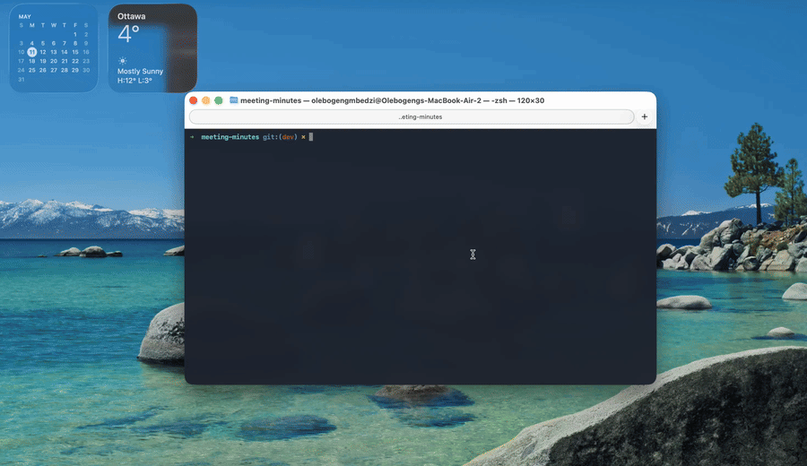
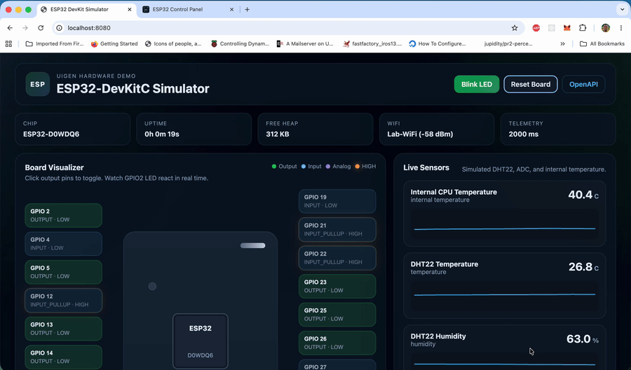

# UIGen

Build & Run Declarative UI Apps. OpenAPI is your foundation. No codegen

<table>
  <tr>
    <td width="50%">
      
    </td>
    <td width="50%">
      
    </td>
  </tr>
  <tr>
    <td align="center"><strong>Meeting Minutes</strong> (FastAPI)</td>
    <td align="center"><strong>Hardware demo</strong> (<a href="./examples/apps/cpp/">examples</a>)</td>
  </tr>
</table>

---

## Getting Started

```bash
# Initialize a new UIGen project
npx @uigen-dev/cli@latest init my-app
cd my-app

# Start the development server
npx @uigen-dev/cli@latest serve openapi.yaml
```

Visit `http://localhost:4400` to see your app.

UIGen scaffolds a complete project with configuration files (`.uigen/config.yaml`, `.uigen/theme.css`), AI agent skills (`.agents/skills/`), and an example spec if needed. The serve command renders a complete UI from your OpenAPI spec at runtime. When your API changes, the UI updates automatically with no regeneration or code maintenance required.

### Desktop (Electron)

Open the generated UI in a native window instead of the browser:

```bash
npx @uigen-dev/cli@latest serve openapi.yaml --target electron
npx @uigen-dev/cli@latest serve openapi.yaml --target electron --proxy-base http://localhost:8000
```

Install the target package when using npm outside the monorepo: `npm install -D @uigen-dev/target-electron`. React renderer only. See the [Electron target docs](https://getuigen.dev/docs/cli-reference/electron-target).

---

## Key Features

### Authentication & Authorization
- **OAuth 2.0 Social Login** - Google, GitHub, Facebook, Microsoft with automatic flow handling
- **Bearer Token, API Key, HTTP Basic** - All standard auth schemes supported
- **Credential-based Login** - Auto-detected from spec with token extraction
- **Environment Variable Support** - Secure credential management with `${VAR_NAME}` syntax

### Data Visualization & Forms
- **Smart Forms** - Auto-generated with validation, file uploads, nested objects, arrays
- **DateTime Formatting** - Declarative format patterns with timezone support
- **File Uploads** - Type-aware validation, previews, drag-and-drop (images, documents, videos)
- **Chart Annotations** - Line, bar, pie, scatter charts from array data
- **Icon Library Support** - Professional icons from Lucide, Heroicons, React Icons with `library:iconName` syntax

### Relationships & Navigation
- **Auto-detected Relationships** - `hasMany`, `belongsTo`, `manyToMany` from path patterns
- **Landing Pages** - Hero, features, pricing, testimonials, FAQ sections
- **Layout System** - Sidebar, centered, dashboard-grid layouts per resource
- **Profile Editing** - Inline editing with validation and conflict handling

### Monetization & Payments
- **Payment Integration** - Stripe, PayPal, Square support with declarative configuration
- **Auto-Generated Pricing Pages** - Define products, get `/pricing` route automatically
- **Payment Gates** - Mark resources as monetized, backend enforces limits with 402 responses
- **Upgrade Prompts** - Automatic interception and conversion flow

### Developer Experience
- **Runtime Rendering** - No code generation, UI stays in sync with spec changes
- **AI Agent Skills** - Automate configuration with your favorite coding assistant
- **Override System** - Replace any view with custom React components (file-based or programmatic)
- **Build Command** - Package for production deployment with `uigen build`
- **Electron Target** - Serve the same UI in a desktop window with `--target electron`

---

## Examples

### Meeting Minutes (FastAPI)

Full-stack web app with auth, file uploads, and relationships.

```bash
git clone https://github.com/darula-hpp/uigen
cd uigen/examples/apps/fastapi/meeting-minutes

docker compose up -d
docker compose exec app alembic upgrade head

npx @uigen-dev/cli@latest init --spec openapi.yaml
npx @uigen-dev/cli@latest serve openapi.yaml --proxy-base http://localhost:8000
```

Visit `http://localhost:4400` for CRUD, auth, file uploads, and relationships.

### ESP32 Hardware (C++)

Board simulator with a visual demo at `:8080` and a UIGen control panel at `:4400`, both driven by the same `openapi.yaml`.

```bash
# Terminal 1 — simulator
cd examples/apps/cpp/esp32-simulator
docker compose up --build

# Terminal 2 — UIGen panel (run from UI/ so .uigen/config.yaml is picked up)
cd examples/apps/cpp/esp32-simulator/UI
npx @uigen-dev/cli@latest serve openapi.yaml --proxy-base http://localhost:8080
```

| URL | What you get |
|---|---|
| `http://localhost:8080` | Interactive board diagram, GPIO, sensors, event log |
| `http://localhost:4400` | Generated admin UI: pins, config, telemetry charts, actions |

See the [ESP32 example README](./examples/apps/cpp/esp32-simulator/README.md) for local build, API reference, and tests.

### Hardware & embedded

Contract-first demos where a backend exposes REST APIs and UIGen generates the admin UI from the same `openapi.yaml`:

| Location | What it shows |
|---|---|
| [`examples/apps/cpp/`](./examples/apps/cpp/) | C++ ESP32 and STM32 board simulators |
| [`examples/apps/nextjs/devboard-simulator/`](./examples/apps/nextjs/devboard-simulator/) | Next.js variant, Vercel-deployable |

Each app includes its own README with setup, ports, and tests. Use the **Generate Device OpenAPI** skill ([`SKILLS/generate-device-openapi.md`](./SKILLS/generate-device-openapi.md)) to draft specs from curl, Postman, or C headers, then **Auto-Annotate** for config.

More examples: [`examples/apps/`](./examples/apps/) and the [example apps guide](https://getuigen.dev/docs/guides/example-apps).

---

## AI Agent Skills

UIGen includes AI agent skills that automate configuration through intelligent analysis of your OpenAPI spec. Skills work with any AI coding assistant (Cursor, Windsurf, Cline, GitHub Copilot).

- **Auto-Annotate** - Detects auth endpoints, file uploads, relationships, charts, and smart labels
- **Generate Device OpenAPI** - Drafts `openapi.yaml` from curl, Postman, C structs, or route tables (embedded/IoT)
- **Configure OAuth** - Sets up OAuth 2.0 social login (Google, GitHub, Facebook, Microsoft)
- **Applying Styles** - Brand colors, dark mode, component styling, animations, responsive design
- **Configure Icons** - Professional icon library integration (Lucide, Heroicons, React Icons)

```bash
npx @uigen-dev/cli@latest init my-app --spec openapi.yaml
# Ask AI: "Use the auto-annotate skill to configure my spec"
npx @uigen-dev/cli@latest serve openapi.yaml
```

**Environment Variables**: Keep sensitive values secure by using `${ENV_VAR_NAME}` syntax in your config file. UIGen automatically loads `.env` files from your spec directory. See the [Environment Variables Guide](https://getuigen.dev/docs/guides/environment-variables) for details.

---

## How It Works

UIGen uses **runtime rendering** to transform your OpenAPI spec into a complete, interactive frontend. Unlike code generators, UIGen interprets your spec at runtime, keeping your UI automatically in sync with API changes.

```
CLI Command
    |
    v
+----------------+     +----------------+     +----------+     +------+     +--------+     +--------------+
| API Document   |---->| Reconciler     |---->| Adapter  |---->|  IR  |---->| Engine |---->|  React SPA   |
| (YAML/JSON)    |     | (Config Merge) |     | (Parser) |     |      |     |        |     | (served)     |
+----------------+     +----------------+     +----------+     +------+     +--------+     +--------------+
       |                      ^                                                                    |
       |                      |                                                          +---------+
       |               +----------------+                                                v
       |               | Config File    |                                          +-----------+
       |               | (.uigen/       |                                          | API Proxy |---> Real API
       |               |  config.yaml)  |                                          +-----------+
       |               +----------------+
       |
       +---> (Source spec unchanged on disk)
```

UIGen reconciles your config with the spec, then parses it into a framework-agnostic Intermediate Representation (IR) containing resources, operations, schemas, authentication flows, and pagination strategies.

The React renderer interprets this IR at runtime and creates table views, forms, detail views, search interfaces, authentication flows, wizards, custom actions, dashboards, and theme support.

**Key advantage:** Runtime rendering means no regeneration step, no code to maintain, no drift between spec and UI. Because the IR is framework-agnostic, you can swap renderers. The same spec works with `@uigen-dev/react`, `@uigen-dev/svelte`, or `@uigen-dev/vue` (coming soon).

---

## Override System

Customize any view while keeping the rest auto-generated. Three modes: **component** (full control), **render** (UIGen fetches data, you control UI), and **useHooks** (side effects only).

```typescript
// src/overrides/users-list.tsx
import type { OverrideDefinition, ListRenderProps } from '@uigen-dev/react';

const override: OverrideDefinition = {
  targetId: 'users.list',
  render: ({ data, isLoading }: ListRenderProps) => {
    if (isLoading) return <div>Loading...</div>;
    return <div className="grid">{/* your custom UI */}</div>;
  },
};

export default override;
```

Wire it up in `.uigen/config.yaml` with `x-uigen-override`. The CLI discovers, transpiles, and injects overrides automatically. See [packages/react/src/overrides/README.md](./packages/react/src/overrides/README.md) and the [override docs](https://getuigen.dev/docs/override-system/overview).

---

## Read More

- **[Full Documentation](https://getuigen.dev)** - Complete guides, API reference, and examples
- **[Architecture](./ARCHITECTURE.md)** - Deep dive into the IR, adapters, and rendering pipeline

---

## Current Priorities
- Polish
- Declarative Websockets support
- Better relationship handling and visualization
- Additional renderers (Svelte, Vue, React Native for device companion apps)

---

## License

[MIT](./LICENSE)
